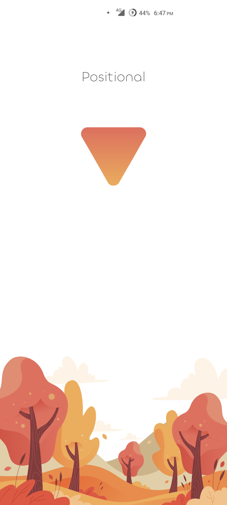
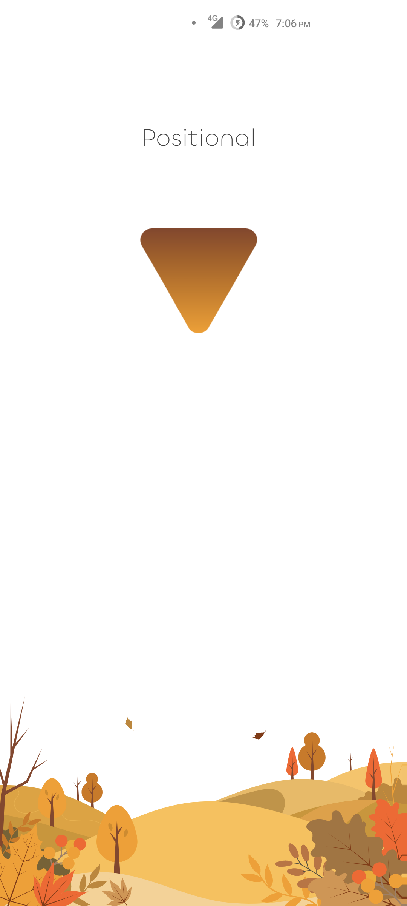
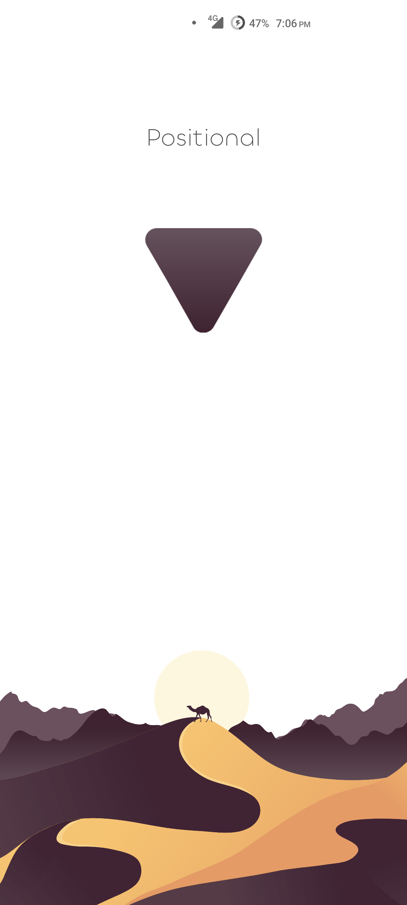
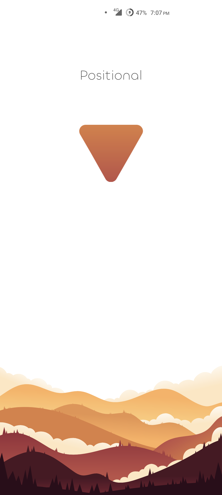
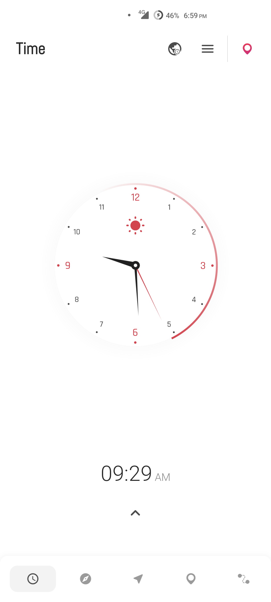

## What's This ?

**Positional** is a location based app that utilizes the device's GPS and fetches various details of
the current latitude and longitude data like Altitude, Speed, Address and similar other information
and show it in easily understandable format to the user. Alongside this main functionality of being
a location app, Positional also provides a separate panel for **Compass** and **Clock**, and they
serve their own purpose as their name suggests.

**Compass** provides info related to direction and **Clock** fetches the time related information
based on the current location and time zone and also sun's information like Sunset, Sunrise,
Twilight and a good deal of other info.

On top of all the core functionality Positional is a highly polished app and provides another layer
of flexibility to customize the app as per liking including skins for Clock and Compass faces,
colors, and many other features that should have been there.

## Download

## Stats

 

## Featured
- [Top Android Apps! (May 2023) - Sam Beckman](https://youtu.be/g6pMQAFfd3Q?t=489)
- [These 6 Android Apps Are a MUST TRY - Jun 2023 - mobiscrub](https://youtu.be/1APiynfp0ZM?t=294)

## Screenshots

### Splash Screens
Pin style is subject to user preferences.

|  |  |  |  |
|:-------------------------:|:-------------------------:|:-------------------------:|:-------------------------:|
|           0x01            |           0x02            |           0x03            |           0x04            |

### Time Panel

|  |  |  | 
|:-------------------------:|:-------------------------:|:-------------------------:|
|           0x01            |           0x02            |           0x03            |

|  |  | 
|:-------------------------:|:-------------------------:|
|           0x04            |           0x05            | 

### Compass Panel

|  |  |  |  |
|:-------------------------:|:-------------------------:|:-------------------------:|:-------------------------:|
|           0x01            |           0x02            |           0x03            |           0x04            |

### Map Panel

|  |  | 
|:-------------------------:|:-------------------------:|
|           0x01            |           0x02            |

### Trail Panel

|  |  |
|:-------------------------:|:-------------------------:|
|           0x01            |            0x2            |

### Level and Preferences Panel

|  |  |
|:-------------------------:|:-------------------------:|
|           0x01            |           0x02            |

## Features

* Easy to use 
* Smooth, with fluid animations 
* Minimal UI 
* Many Accent Colors 
* Customizable with various options to choose from 
* Magnetic Compass 
* Compass Sensor Speed 
* Compass physics properties 
* Compass manual rotation
* Compass bloom
* Gimbal lock
* Minimal Map (with and without labels) 
* Google Maps Support 
* Dark mode for maps 
* High contrast map 
* Satellite map 
* Many pin styles for the whole app 
* Media keys support for map 
* Target location mode
* Displacement information
* GPS information 
* Speedometer 
* Altitude 
* Distance 
* Displacement 
* Address of the current location 
* UTM, MGRS coordinate formatting 
* DMS coordinates support 
* Movement direction 
* Clock 
* Clock motion types (both linear and inertia induced motion) 
* Clock needle styles 
* Custom timezone support 
* UTC and Local Time references 
* Sun Position/Location 
* Sun Azimuth 
* Sun Distance and Sun Altitude 
* Sunset and Sunrise time 
* Astronomical, Nautical, Civil twilight 
* Moon Position/Location 
* Moonrise and Moonset time 
* Moon Altitude 
* Moon Phases 
* Moon Angle and Fraction 
* Moon states (Waning and Waxing) 
* Upcoming moon dates i.e. New Moon, Full Moon, Third and First Quarter 
* Moon Illumination 
* Dark Mode 
* Level  
* Custom location mode for manually fetching information of any part of the world 
* Sun time widgets
* Sun time widget with splash arts
* Clock widget
* Moon phase widget
* Completely Ad-Free

## Road Map

Last updated: 2023, April 12

- [ ] Add a custom date mode along with specified coordinates
- [ ] Add a timeline view for moon dates up to a few years in the future and past
- [x] Add a 3D solar data model for visual representation
- [ ] Solar and Lunar Eclipse dates
- [x] Make the app landscape

## Contribution

Pull requests are welcome. For major changes, please open an issue first to discuss what you would
like to change.

## Translate

This app has been as of completely translated in these languages.

* Bulgarian
* English
* Hindi
* Urdu
* French
* Czech
* Romanian
* Russian
* Chinese (Traditional)
* Portuguese (Brazil)

You can also contribute into translating the app in your native language
on [Crowdin](https://crowdin.com/project/positional/).

## License

**Positional** Copyright © 2023 - Hamza Rizwan

**Positional** is released as open source software under
the [GPL v3](https://opensource.org/licenses/gpl-3.0.html)
license, see the [LICENSE](./LICENSE) file in the project root for the full license text.

[1]: http://www.inf.ufrgs.br
